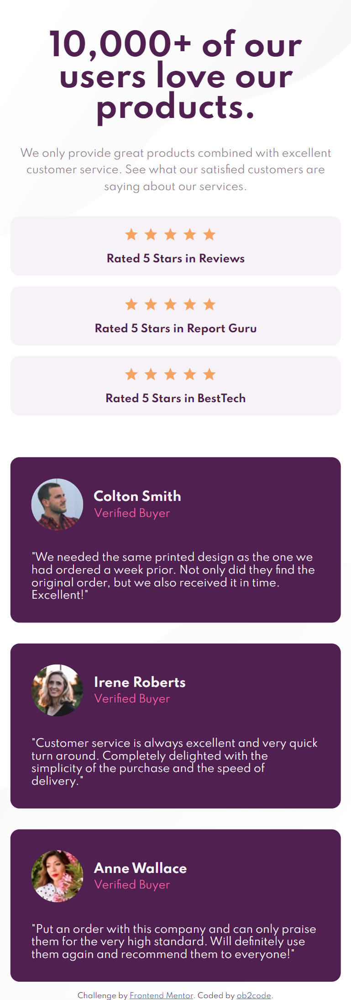
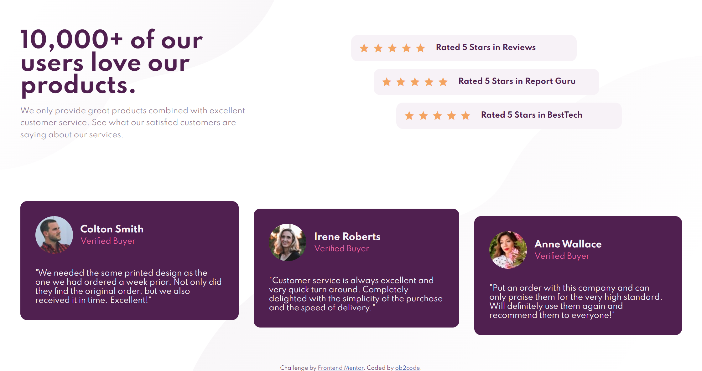

# Frontend Mentor - Social proof section solution

This is a solution to the [Social proof section challenge on Frontend Mentor](https://www.frontendmentor.io/challenges/social-proof-section-6e0qTv_bA). Frontend Mentor challenges help you improve your coding skills by building realistic projects. 

## Table of contents

- [Overview](#overview)
  - [The challenge](#the-challenge)
  - [Screenshot](#screenshot)
  - [Links](#links)
- [My process](#my-process)
  - [Built with](#built-with)
  - [Useful resources](#useful-resources)
- [Author](#author)
- [Acknowledgments](#acknowledgments)

## Overview

### The challenge

Users should be able to:

- View the optimal layout for the section depending on their device's screen size
- My own challenge: animate background image for visual, please notice the first 3 seconds when loading my site. 😁

### Screenshot

Mobile version

Desktop version

### Links

- Solution URL: [https://github.com/ob2code/social-proof-section.git](https://github.com/ob2code/social-proof-section.git)
- Live Site URL: [https://ob2code-social-proof.netlify.app](https://ob2code-social-proof.netlify.app)

## My process

### Built with

- Plain HTML
- SASS
- Flexbox
- CSS Grid: layout the main content and footer.

### Improvement

- Use CSS ::after Pseudo-Element for person's title
- 

### Useful resources

- [Mordern CSS](https://moderncss.dev/) - This helped me for structure SASS folder, Media queries mixins.
- [Steps to replicate a design with only HTML and CSS](https://devchallenges-blogs.web.app/how-to-replicate-design/) - Recommended resources for basic steps to building a website.

## Author

- 💻Website [ob2code.netlify.app](https://ob2code.netlify.app/)
- 💪Frontend Mentor - [@ob2code](https://www.frontendmentor.io/profile/ob2code)
- 👨‍💻GitHub [@ob2code](https://github.com/ob2code)
- 🐤Twitter [@ob2code](https://twitter.com/ob2code)

